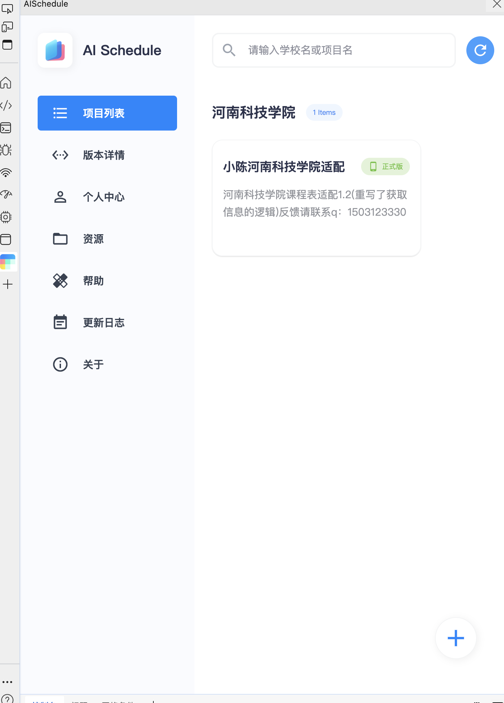
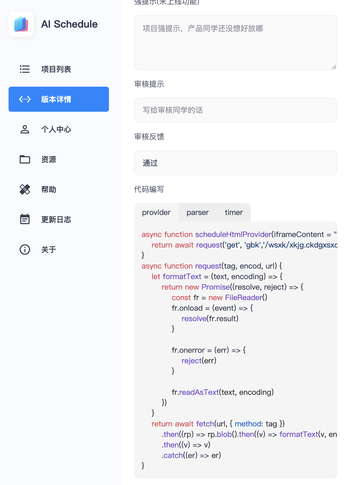

# 小米小爱（js）青果教务系统小爱课程表适配

#### 介绍
1. 课程表的适配主要是对dom层的提取归类处理
2. 课程表的适配主要是通过操作`scheduleHtmlProvider，scheduleHtmlParser，scheduleTimer函数完成的`

#### 软件架构

#### 安装教程

| 功能                      | 作用        | 
|-------------------------|-----------|
| scheduleHtmlProvider.js | 获取 dom 信息 |
| scheduleHtmlParser.js   | 解析处理 dom  | 
| scheduleTimer.js        | 设置节次数量，时间 |
#### 使用/适配流程

1.  下载官方插件
> 可以通过课程表适配的官方网址下载插件，安装到浏览器，进行相关项目的适配 <a href="https://open-schedule-prod.ai.xiaomi.com/docs/#/help/">https://open-schedule-prod.ai.xiaomi.com/docs/#/help/</a>
2. 创建学校项目
3. 
> 可以在浏览器控制台创建浏览器项目
3. 编写测试

> 后面就可以根据提示对三个方法进行编写测试了

#### 说明

1.  代码来自于河南科技学院教务系统适配，不确保能适配其他教务系统
2.  代码没有经过充分测试，仅仅自用，不确保没有bug